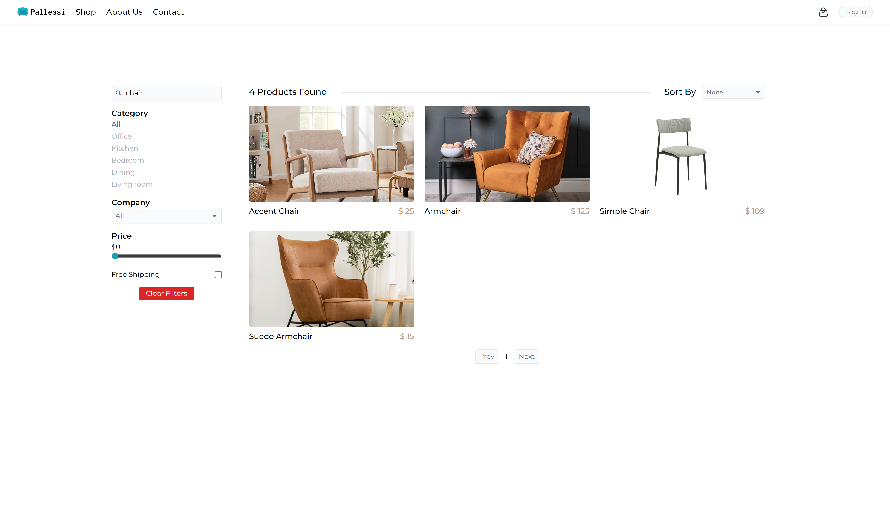
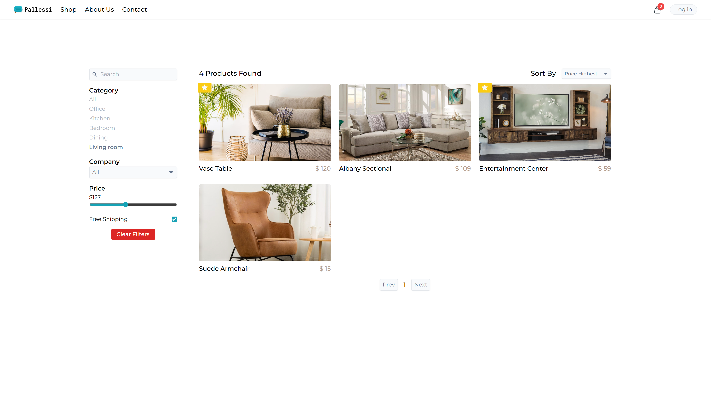
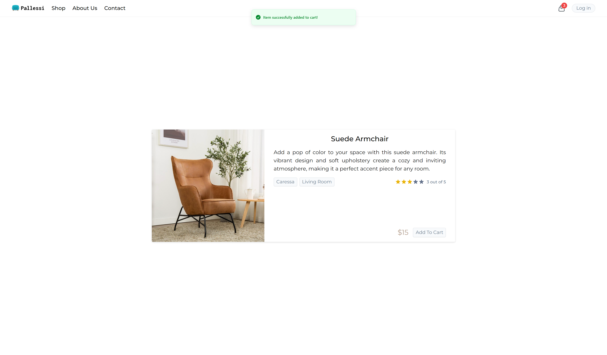
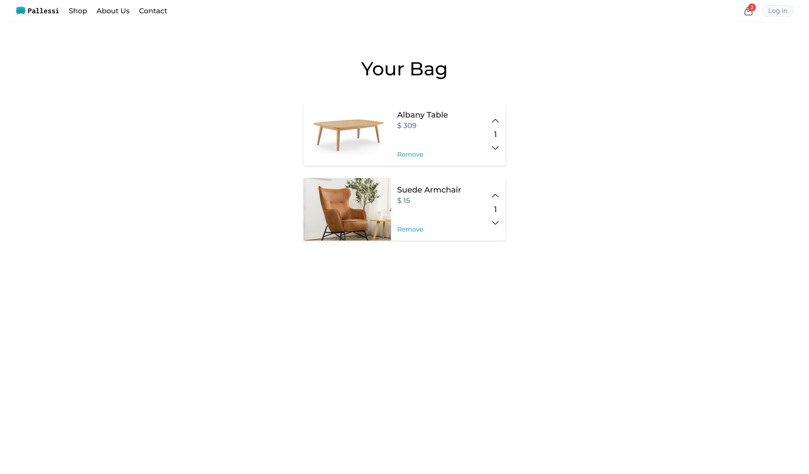
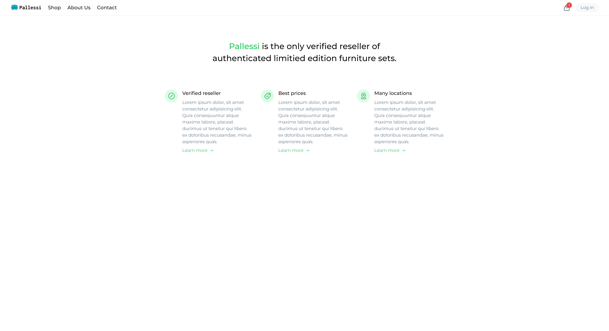
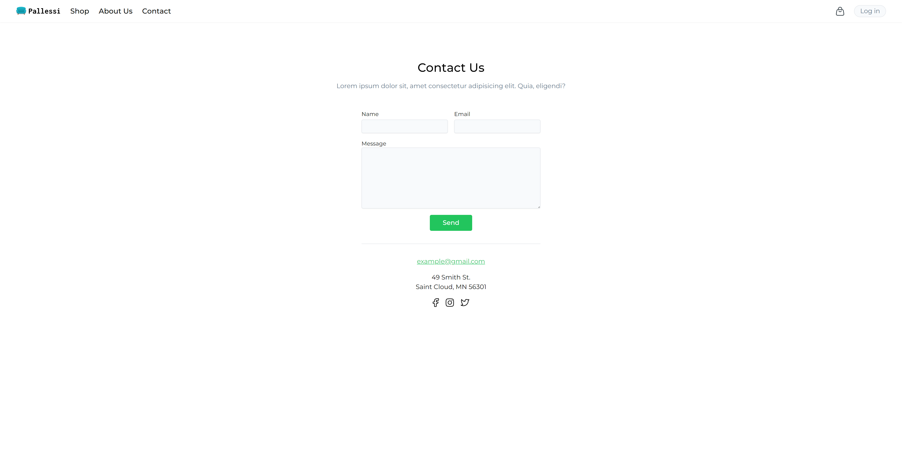

# Welcome to my E-Commerce Web App!

This is a full-stack application built using React, Vite, Tailwind CSS, Node.js, Express, and MongoDB. The app allows users to browse and purchase furniture products from various brands and categories. Sellers will be able to register and post their own furniture products using the admin dashboard.

## Features

<b>Product Listing:</b> Users can view a wide range of furniture products from different brands and categories. 
<b>Product Filtering:</b> Users can easily filter products based on brand, category, price range, etc. 
<b>Product Details:</b> Users can view detailed information about each product, including images and descriptions. 
<b>Responsive Design:</b> The app is responsive and works seamlessly on various devices. 

## Technologies Used

<b>ReactJS:</b> A popular JavaScript library for building user interfaces. It provides a component-based architecture and allows for efficient rendering of dynamic UI elements. 
<b>Vite:</b> A fast build tool for modern web applications. Vite offers quick development server startup and instant hot module replacement, optimizing the development experience. 
<b>NodeJS:</b> A JavaScript runtime built on Chrome's V8 JavaScript engine. It enables server-side scripting and allows for building scalable network applications. 
<b>Tailwind CSS:</b> A highly customizable, utility-first CSS framework for building modern and responsive user interfaces.
<b>MongoDB:</b> A NoSQL database system that stores data in a flexible, JSON-like format called BSON. It provides high scalability, performance, and flexibility for managing structured and unstructured data. 

## Future enhancements

<b>User Registration and Login:</b> Users can create accounts and log in to access personalized features.  
<b>Seller Registration:</b> Sellers can register on the platform to post their own furniture products. 
<b>Shopping Cart:</b> Users can add products to their shopping cart and proceed to checkout. 
<b>Admin Dashboard:</b> Sellers have access to a user-friendly dashboard to manage their product listings. 

## Contributing

Contributions are welcome! If you find any issues or want to add new features, please open an issue or submit a pull request.

